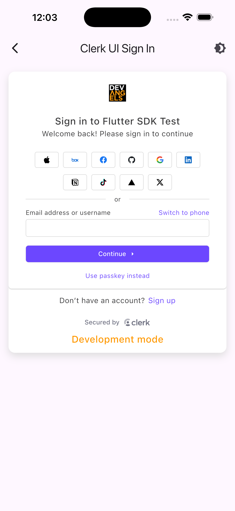
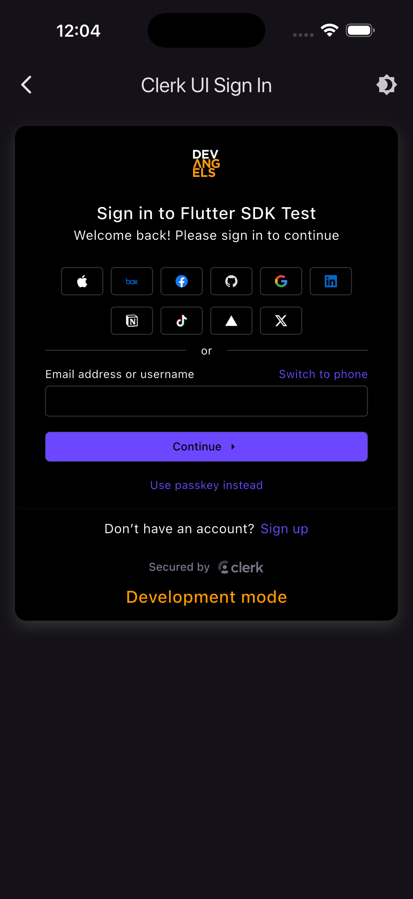

  <a href="https://clerk.com?utm_source=github&utm_medium=sdk_flutter" target="_blank" rel="noopener noreferrer">
    <picture>
      <source media="(prefers-color-scheme: dark)" srcset="https://images.clerk.com/static/logo-dark-mode-400x400.png">
      
    </picture>
  </a>
   

# Clerk Flutter and Dart SDKs

**Clerk helps developers build user management. We provide streamlined user experiences for your users to sign up, sign in, and manage their profiles.**

> ### ⚠️ Beta Notice
> These SDKs are currently in Beta. Breaking changes should be expected until the first stable release (1.0.0).

  
  
   
  <em>The clerk_flutter example app</em>

---

## 📦 Packages

| Package | Description | Pub |
|---------|-------------|-----|
| [clerk_auth](./packages/clerk_auth) | Dart SDK for Clerk authentication |  |
| [clerk_flutter](./packages/clerk_flutter) | Flutter UI components for Clerk authentication |  |

## 📄 License

This project is licensed under the MIT license.

See [LICENSE](./LICENSE) for more information.
